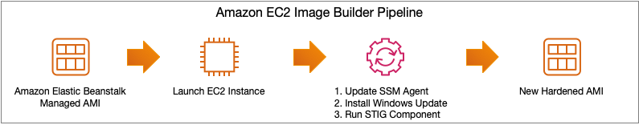
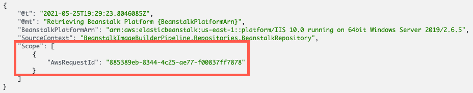
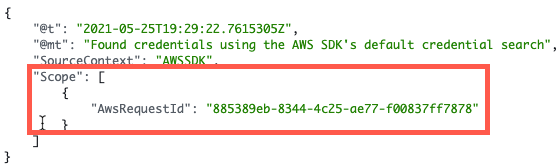

# Elastic Beanstalk EC2 Image Builder Pipeline for Windows Automation

This project demonstrates how to detect when an Elastic Beanstalk platform's base AMI has been updated and starts an EC2 Image Builder Pipeline to automate the creation of a golden image.

## License
This library is licensed under the MIT-0 License. See the [LICENSE](LICENSE.TXT) file.

Additionally, this project installs the following software for the purposes of deploying and running the application:

* [Microsoft .NET](https://github.com/dotnet/runtime) is an open source developer platform, created by Microsoft is provided under the MIT License.
* [Serilog](https://github.com/serilog/serilog) is an open source software diagnostic logging library for .NET applications provided under the Apache 2 License.
* [Moq](https://github.com/moq/moq4) is an open source software mocking library for .NET provided under the BSD 3-Clause License.

## Table of Contents
- [Elastic Beanstalk EC2 Image Builder Pipeline for Windows Automation](#elastic-beanstalk-ec2-image-builder-pipeline-for-windows-automation)
  - [License](#license)
  - [Table of Contents](#table-of-contents)
  - [Overview](#overview)
  - [Project Structure](#project-structure)
  - [Running the Code](#running-the-code)
    - [Environment Variables](#environment-variables)
      - [AmiMonitor](#amimonitor)
      - [ImageBuilderTrigger](#imagebuildertrigger)
  - [Design](#design)
    - [Static Relationships](#static-relationships)
      - [Namespaces](#namespaces)
      - [Classes](#classes)
    - [Dynamic Behavior](#dynamic-behavior)
      - [Lambda Function Initialization](#lambda-function-initialization)
        - [Logging](#logging)
        - [Dependency Injection](#dependency-injection)
      - [AMI Version Change Monitoring](#ami-version-change-monitoring)
      - [EC2 Image Builder Pipeline Execution](#ec2-image-builder-pipeline-execution)
  - [Security](#security)

## Overview

This project provides a sample solution to automate the execution of an EC2 Image Builder Pipeline that uses an Amazon Elastic Beanstalk managed AMI as the source AMI. There are currently two parts to the solution, each a Lambda function:

* **AmiMonitor** - Determines when the Amazon Elastic Beanstalk managed AMI has been updated for a platform. This function is invoked on a schedule.
* **ImageBuilderTrigger** - Starts the execution of an Amazon EC2 Image Builder pipeline when the Parameter Store parameter referencing the Elastic Beanstalk managed AMI is updated

Both of these Lambda functions are contained in the same .NET assembly.

## Project Structure

This project follows the [src project structure](https://docs.microsoft.com/en-us/dotnet/core/porting/project-structure). In other words, this:
```
├─ src
│  └─ Project
│     └─ ...
├─ tests
│  ├─ Project.UnitTests
│  └─ ...
```
## Running the Code
The code was developed using .NET 5. Because .NET 5 is not a LTSC release, [AWS Lambda's support for container images](https://aws.amazon.com/blogs/developer/net-5-aws-lambda-support-with-container-images/) was used. Once you have cloned the repository, you can execute the following command _from the project's root folder_ to run the unit tests included with the project to ensure all dependencies have been downloaded.

```shell
dotnet test
```

The output should be similar to the following, showing the results of the unit tests that were executed.


Visual Studio is recommended for local development as it can ease the deployment of the of the SAM template.

### Environment Variables

#### AmiMonitor
* **PLATFORM_ARN** - The ARN of the Elastic Beanstalk platform version to monitor for changes.
* **SSM_PARAMETER_NAME** - Name of the Systems Manager Parameter Store parameter used to store the latest AMI ID for the Beanstalk Platform version being monitored.

#### ImageBuilderTrigger
* **IMAGE_PIPELINE_ARN** - The ARN of the EC2 Image Builder Pipeline that needs to be executed when a new version of the Elastic Beanstalk platform AMI is detected.
## Design


The solution has been split into two components. The first is one monitors the selected Elastic Beanstalk platform for changes to the AMI associated with it and ensures that a Systems Manager Parameter Store parameter is kept up to date.


The next component picks up where that Systems Manager Parameter Store parameter left off and will update the associated EC2 Image Builder Pipeline's recipe with the updated AMI ID, and will trigger the execution of the pipeline so that a new AMI is created.


The build stage of the EC2 Image Builder pipeline included in this project follows the steps depicted above. A custom [Image Builder Component](https://docs.aws.amazon.com/imagebuilder/latest/userguide/image-builder-application-documents.html) is also included that updates the SSM Agent prior to installing Windows Updates, and executing the [EC2 Image Builder STIG Medium Component](https://docs.aws.amazon.com/imagebuilder/latest/userguide/image-builder-stig.html) to harden the AMI.

Let's take a closer look at the classes that make up the Lambda functions.

### Static Relationships
All of the Lambda functions are contained within a single Visual Studio project (BeanstalkImageBuilderPipeline). See the [Best practices for organizing larger serverless applications](https://aws.amazon.com/blogs/compute/best-practices-for-organizing-larger-serverless-applications/) blog post for other options on organizing your functions.

This results in a single Docker image being used for both functions with the Lambda's entry point (specified by the [Command property of ImageConfig](https://docs.aws.amazon.com/lambda/latest/dg/API_ImageConfig.html)) selecting the appropriate function to call at runtime. For instance, the below excerpt from the serverless.template is used to invoke the AmiMonitor function.

``` yaml
ImageConfig:
  Command:
  - BeanstalkImageBuilderPipeline::BeanstalkImageBuilderPipeline.AmiMonitor::Handler
```

#### Namespaces


There are three major namespaces that make up the solution
* BeanstalkImageBuilderPipeline - Contains the Lambda functions
* BeanstalkImageBuilderPipeline.Repositories - Contains the [repository classes](https://martinfowler.com/eaaCatalog/repository.html) used to abstract access to AWS services.
* BeanstalkImageBuilderPipeline.Events - Contains classes representing event payloads not already provided by the AWS SDK.

#### Classes


The base class for all Lambda functions is named LambdaFunction and provides functionality such as lazy initialization of an IServiceProvider that can be used for Dependency Injection, as well as the ConfigureServices template method used to allow subclasses to register their own dependencies.

The two methods depicted in the class diagram are key to how the Lambda functions are initialized. The following section covers how these types interact with each other.

### Dynamic Behavior
#### Lambda Function Initialization


At the start of the Lambda execution environment, the LambdaFunction class takes care of initializing the IServiceProvider instance that used to provide Dependency Injection to the Lambda function.

The LambdaFunction class does this by calling the GetServiceProvider method which in turn creates an instance of [.NET's Generic Host](https://docs.microsoft.com/en-us/dotnet/core/extensions/generic-host). The Generic Host is used because it configures:

* Logging (using Serilog)
* Dependency Injection (using .NET's Service Provider)
* Configuration (using .NET's Configurationg Provider)

##### Logging
[Serilog](https://serilog.net) is used to provide Structured Logging, and .NET's support for [log scopes](https://docs.microsoft.com/en-us/dotnet/core/extensions/logging?tabs=command-line#log-scopes) is used to add metadata to each log entry (e.g., [AWS Request Id](https://docs.aws.amazon.com/lambda/latest/dg/csharp-context.html)). This additional metadata can be seen in log entries created by the application or its dependencies. For example, the below are from CloudWatch:

This is a log entry created by the application.



This is a log entry created by AWS SDK for .NET. Notice that the Scope property has the same AwsRequestId value for both log entries.



##### Dependency Injection
Once the Generic Host has initialized the Service Collection, the ConfigureServices [template method](https://en.wikipedia.org/wiki/Template_method_pattern) is called so that LambdaFunction's subclasses may register their dependencies.

#### AMI Version Change Monitoring


The AmiMonitor Lambda function is executed on a schedule by using an [EventBridge scheduled rule](https://docs.aws.amazon.com/eventbridge/latest/userguide/eb-create-rule-schedule.html). AmiMonitor retrieves the latest AMI version for the Beanstalk platform specified in the PLATFORM_ARN [environment variable](#environment-variables) using the [DescribePlatformVersion](https://docs.aws.amazon.com/elasticbeanstalk/latest/api/API_DescribePlatformVersion.html) API call.

If the AMI ID returned is different than the value of the Systems Manager Parameter Store parameter specified in the SSM_PARAMETER_NAME [environment variable](#environment-variables), the parameter is updated.

This parameter update kicks off the second half of the process (i.e. starting the execution of the EC2 Image Builder Pipeline).

#### EC2 Image Builder Pipeline Execution

The ImageBuilderTrigger Lambda function is invoked using an [EventBridge rule](https://docs.aws.amazon.com/eventbridge/latest/userguide/eb-create-rule.html) triggered when a ["Parameter Store Change" event](https://docs.aws.amazon.com/systems-manager/latest/userguide/sysman-paramstore-cwe.html) is raised for either the "Update" or "Create" operations.

Once triggered, the Lambda function retrieves the parameter's value (i.e. the new AMI ID) from Parameter Store, and creates a new version the Image Builder Recipe associated with the Image Builder Pipeline referenced in the IMAGE_PIPELINE_ARN [environment variable](#environment-variables). 

With the new recipe referencing the latest AMI ID, a new execution of the pipeline is started, creating a new golden image.
## Security
See [CONTRIBUTING](CONTRIBUTING.md#security-issue-notifications) for more information.
